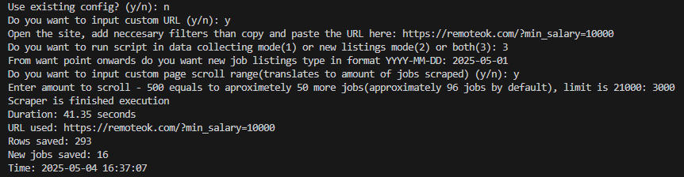

# RemoteOK Job Scraper

A simple and efficient command-line tool for scraping job listings from [RemoteOK](https://remoteok.com), built using `zendriver` and `BeautifulSoup`. This tool allows users to collect job data, detect new listings since a specified date, or perform both actions. The results are exported to clean, structured CSV files for further analysis.

---

## Author

- **Alexandr Lysenko** – [GitHub](https://github.com/Entire-Circus)

---

## Table of Contents

- [Features](#features)
- [Requirements](#requirements)
- [Installation](#installation)
- [Usage & Output](#usage--output)
- [CLI Example](#cli-example)
- [Sample Output](#sample-output)
- [License](#license)

---

##  Features

- Command-line interface (CLI) for flexible interaction
- Configurable scraping options saved in a config file
- Export job listings to CSV format
- Choose between three modes:
  - Full data collection
  - Change detection (new jobs only)
  - Combined mode
- Date-based filtering for new listings
- Clean and minimal dependency set

---

## Requirements

- Python 3.10 or higher
- The following Python libraries:
  - `zendriver`
  - `beautifulsoup4`
  - `pandas`

---

## Built With

- [Python 3.10+](https://www.python.org/)
- [BeautifulSoup4](https://www.crummy.com/software/BeautifulSoup/)
- [zendriver](https://pypi.org/project/zendriver/)
- [pandas](https://pandas.pydata.org/)

---

## Installation

Clone the repository and install dependencies:

```bash
git clone https://github.com/Entire-Circus/remoteok-job-scraper.git
cd remoteok-job-scraper
pip install -r requirements.txt
```

## Usage & Output

Run the scraper from the command line:

```bash
python -m src.main
```
You'll be prompted to:

Choose whether to reuse existing configuration or enter new settings

Optionally paste a filtered job search URL from RemoteOK

Select a scraping mode:

1 – Full data collection

2 – Detect new listings since a date

3 – Perform both actions

(If applicable) Enter a start date in YYYY-MM-DD format

### Output:

All scraped job listings are saved as CSV files in the /data folder

User settings and options are stored as JSON configs in the /config folder

---

## Example Usage

Below is a sample run of the scraper CLI:



---

## Sample Output

The scraper exports job listings to CSV files. Here's an example of the output format:
```csv
Job Title,Link,Posted (Date),Posted (Relative),Estimated salary,Location,Contractor?,Company Name,Tag1,Tag2,Tag3
Influencer Marketing Intern,https://remoteok.com/.../1093103,04/05/2025,2h ago,$30k - $60k,Germany | Norway | Sweden,Not contractor,NextStep,Influencer-Marketing,Internship,Remote
Freelance Writer,https://remoteok.com/.../1077541,05/04/2025,30d ago,$50k - $70k,Worldwide,Contractor,IAPWE,Non Tech,Content Writing,N/A
```
(Links shortened for display. Actual CSV contains full URLs.)

> This project was developed as a portfolio example. Feel free to explore the code.
